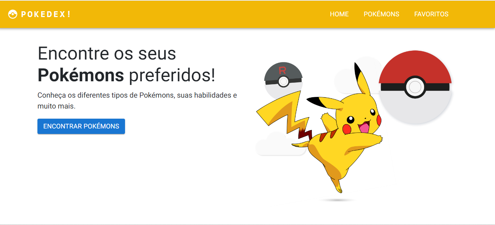

<h1 align="center"> POKEDEX! </h1>

  Aplicação desenvolvida utilizando a API pokeapi para disponilizar um conjunto de pokémons para os usuários. Algumas funcionalidades - como a seção de favoritos - ainda estão indisponíveis pois o projeto está em desenvolvimento. 

  <a href="#-tecnologias">Tecnologias</a>&nbsp;&nbsp;&nbsp;|&nbsp;&nbsp;&nbsp;
  <a href="#-projeto">Projeto</a>&nbsp;&nbsp;&nbsp;|&nbsp;&nbsp;&nbsp;
  <a href="#-layout">Layout</a>&nbsp;&nbsp;&nbsp;|&nbsp;&nbsp;&nbsp;

  

  

 

  

## 🚀 Tecnologias

Esse projeto foi desenvolvido com as seguintes tecnologias:

- ReactJS;
- JS;
- Git e Github;
- MUI;
- Firebase

## 💻 Projeto

 A aplicação está responsiva e pode ser acessada de diversos tipos de dispositivos. É possível observar listar uma série de pokémons(100) e procurar o escolhido para analisar mais informações.

## :memo: Licença

Esse projeto está sob a licença MIT.

---

Feito com ♥ by Tiago Ferreira
